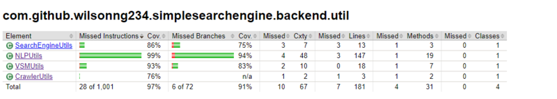
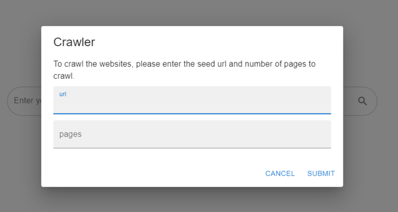
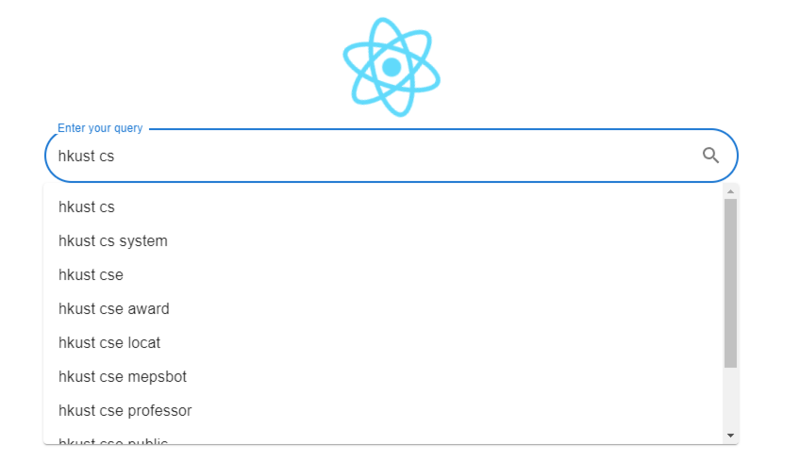
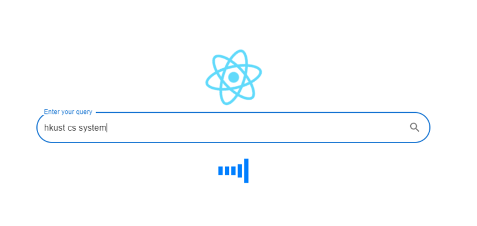
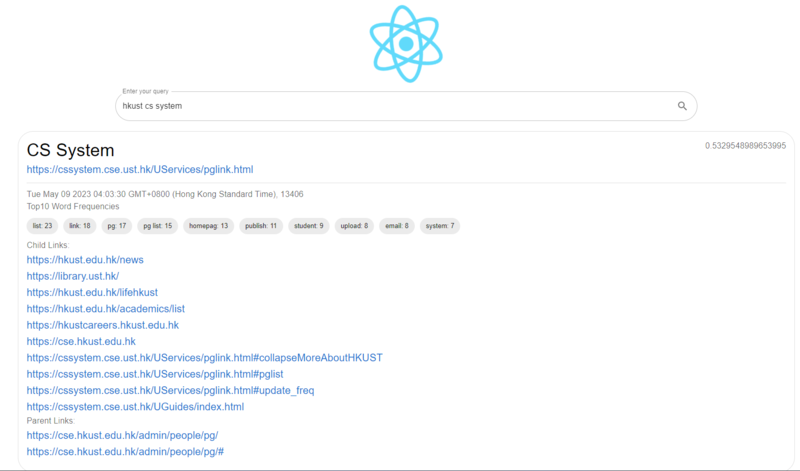

# Search Engine Project

# Abstraction

The project aims to develop a robust and efficient search engine that can crawl and index web pages and enable users to
search for relevant webpages based on the query provided. The project is implemented based on the Java Spring Framework.
The frontend of the search engine is developed using React.js. The backend of the search engine is powered by MongoDB, a
NoSQL document-oriented database that enables fast and flexible data storage and retrieval.

# System Design

## File structure

The file structure used in the database are B+ Tree, which is supported by MongoDB. B+ Tree is a commonly used data
structure for indexing in database. It provides efficient methods for searching, inserting, and deleting data, and it is
well-suited for handling large datasets. The useful keys will be indexed as a single key or composite key to support
quick retrieval of our use cases. B+ Tree also supports quick regex prefix truncation as stated in MongoDB Manual. It is
useful to provide user instant query recommendations based on the prefix entered.

## Database Design

We use MongoDB for storing the data.  
The following collections are used:

1. `documents`(collection)

    - Fields: `docId`, `url`, `size`, `title`, `lastModificationDate`, `titleWordFreqs`, `bodyWordFreqs`, `childrenUrls`, `titleMaxTF`, `bodyMaxTF`
    - Primary key: `docId`
    - Indexes: `docId`(indexed, unique), `url`(indexed, unique)

    This collection stores the statistics of a web page, such as its size, title, last modification date, word frequency information, child page URLs, and the maximum term frequency over all its terms. The docId and url are indexed to provide faster access to the document by either its unique ID or its unique URL.  
    This collection also serves as a `ForwardIndex`, which supports quick search of statistics in a page by docId or
    url.  
    <br>

2. `words`(collection)

    - Fields: `wordId`, `word`
    - Primary key: `wordId`
    - Indexes: `wordId`(indexed, unique), `word`(indexed, unique)

    This collection stores the wordId and word of each word in the corpus. The wordId and word are indexed to provide quick access to the word by its id or to the id by its word. The words stored under this collection is up to tri-gram, but it can also be extended to n-gram by storing the n-gram words into the collection directly or separate the collection into multiple collections.  
    <br>

3. `postings`(collection)

    - Fields: `postingId`, `type`, `wordId`, `docId`, `tf`
    - Primary key: `postingId`
    - Indexes: `{type, wordId}`(compound indexed), `{type, wordId, docId}`(compound indexed, unique)
    - Check constraints: `type in {"title", "body"}`

    The collection stores the posting information of each word in each page. It is logically separated to `TitlePosting` and `BodyPosting` by its type field. For each type, the wordId is indexed to provide a range retrieval based on its wordId. Also, the wordId and docId are indexed to provide an exact posting retrieval based on its wordId and docId.  
    This collection also serves as a `TitleInvertedIndex` and `BodyInvertedIndex`, which supports quick search of posting
    the posting list by {type, wordId}.  
    <br>

4. `parentLinks`(collection)

    - Fields: `url`, `parentUrls`
    - Primary key: `url`
    - Indexes: `url`(indexed, unique)

    The collection stores the parent urls of each page url. The url is indexed to provide quick access to the parent urls of each page. The url is stored as a string for database consistency in case the page is not indexed and the docId is not assigned.  
    <br>

5. `termWeights`(collection)

    - Fields: `docId`, `termWeights`
    - Primary key: `docId`
    - Indexes: `termWeightId`(indexed, unique), `docId`(indexed, unique)

    The collection stores the term weights of each page docId. The docId is indexed to provide quick access to the term weights of the page. The term weights are combined with its page rank for the final score calculation and will be specified in the [algorithm](#term-weighting) section of the report.  
    <br>

6. `pageRanks`(collection)

    - Fields: `docId`, `pageRank`
    - Primary key: `docId`
    - Indexes: `docId`(indexed, unique)

    The collection stores the page rank of each page docId. The docId is indexed to provide quick access to the page rank of the page. The page rank is combined with its term weight for the final score calculation and will be specified in the [algorithm](#pagerank) section of the report.  
    <br>

# Algorithm

## Crawler

The crawler uses JSoup to parse the HTML of the web pages. It will extract the title, body, size, last modification date and child URLs of the page. The order of crawling strategy is based on the BFS algorithm. It will start from the seed URL and crawl the web pages in breadth-first order. The stopping criteria is when the number of crawled pages reaches the limit or when there is no more pages to crawl.

## Term Weighting

idf = log2(N/df)  
term weight = tf/maxTF * idf  

The term weighting is based on the TF-IDF algorithm. The term frequency is calculated by the number of times the term is found in the page. The inverse document frequency(idf) is calculated by the logarithm of the total number of pages divided by the number of pages that contain the term. The term weight is calculated as the product of the term frequency and the idf.

## PageRank

The PageRank algorithm is used to rank the pages based on the link structure of the web. The PageRank algorithm is based on the following formula:  
PR = (1-d) + d \* [PR(T1)/C(T1) + ... + PR(Tn)/C(Tn)]  
where PR is the PageRank of the page, d is the damping factor, T1, ..., Tn are the pages that link to the page, and C(T1), ..., C(Tn) are the number of outbound links of T1, ..., Tn.  
d is set to 0.85 in our implementation.  
The outbound link does not contain duplicate in our implementation. Therefore, spamming the outbound link will not affect the PageRank of the page.

## Mechanism favoring title words

The words in the title and in the body will share the same entry in the `words` collection. However, the term weight calculation of title words and body words are different. Given the same word, it will have different term frequency, maxTF, document frequency, and inverse document frequency in the title and in the body. Therefore, the term weight of the title words and body words are calculated separately. In additional to it, the title words are favoured by multiplying a constant factor to its term weight. The constant factor is set to 10.0 in our implementation. The following code example illustrates the term weight calculation of title words and body words:

```java
class TermWeightExample {
    public static void example() {
        double titleWeight = 10.0;
        for (Posting posting : titlePostings) {
            // add the term weight of title words
            double originTermWeight = documentsVector.get(docIndex).get(wordIndex);
            double additionTermWeight =
                titleWeight * VSMUtils.getTermWeight(titleTF, numDocs, titleDocFreq, titleMaxTF);
            documentsVector.get(docIndex).set(wordIndex, originTermWeight + additionTermWeight);
        }

        for (Posting posting : bodyPostings) {
            // add the term weight of body words
            double originTermWeight = documentsVector.get(docIndex).get(wordIndex);
            double additionTermWeight =
                VSMUtils.getTermWeight(bodyTF, numDocs, bodyDocFreq, bodyMaxTF);
            documentsVector.get(docIndex).set(wordIndex, originTermWeight + additionTermWeight);
        }
    }
}
```

## Query Processing

The query will be tokenized and be used to extract the normalWords and phraseWords. The phraseWords are quoted terms quoted by `"` and the normalWords are uni-grams that include both the quoted terms and the unquoted terms.  
For example: query `"test page` will be parsed as `phraseWords: ["test page"], normalWords: ["test", "page"]`.

The query will be processed in the following steps:

1. Extract normal words:
    - The normal words will be tokenized
    - The normal words will remove the leading and trailing punctuations
    - The normal words will be stemmed by the Porter Stemmer
    - The normal words will remove the stop words using the stemmed [stop word list](src/main/resources/static/stopwords.txt)
2. Extract phrase words:
    - The phrase words will be extracted by parsing the quoted terms
    - The phrase words will be tokenized
    - The phrase words will remove the leading and trailing punctuations
    - The phrase words will be stemmed by the Porter Stemmer
    - The phrase words will not remove the stop words to follow the crawler's nGram extraction strategy
    - The phrase words will be joined by space to form the phrase and try to match the words in the `words` collection

The query vector will be formed by the frequency of normal words and phrase words.  
For normal words, each word frequency will contribute to a weight of 1 to the query vector.  
For phrase words, each phrase word frequency will contribute to a weight of 10 to the query vector.  
Therefore, if the phrase is both the title and a phrase word, it will contribute to a score of 10\*10 times more than comparing to a normal word in the body.  
This will be illustrated in the following code example:

```java
class queryExample {
    public static void example() {
        for (String normalWord : normalWords)
            queryVector.set(wordIndex, queryVector.get(wordIndex) + 1.0);
        for (String phrase : phraseWords)
            queryVector.set(wordIndex, queryVector.get(wordIndex) + 10.0);
    }
}
```

## Score calculation

The score of each page will be calculated as a linear combination of page rank and cosine similarity of the query vector and the document vector.  
Query vector is formed as stated in Query Processing section.  
Document vector is formed by the term weight of each word in the document.  
Score of each page is calculated by the following formula:  
`score = w1 * cosineSimilarity(queryVector, documentVector) + w2 * pageRank`  
where `w1 = 0.8` and `w2 = 0.2` in our implementation.

# Installation Procedure

The installation procedure is documented in README.md in the root directory of the project.

# Additional Features

## Grammatical filtering

Standford CoreNLP library is used to perform parts of speech recognition.  
After using the CoreNLP library to get the pos tag of each word, the biGrams and triGrams will be filtered by the following grammatical rules to extract useful phrases only:

```
// JJ: adjective
// NN: noun
// IN: preposition or subordinating conjunction
BiGram:
    JJ NN
    NN NN
TriGram:
   JJ JJ NN
   JJ NN NN
   NN JJ NN
   NN NN NN
   NN IN NN
```

## Page Rank

The page rank algorithm and the formula to combine it with tfidf is illustrated in the [Algorithm](#algorithm) section of the report already.

## Multithreading

Multithreading is used for the calculation of term weight. Each task will handle a chunk of words in the `words` collection and perform update to the same document vector in parallel. After all the tasks are completed, the document vector will be stored in the `termWeights` collection. The search engine query the `termWeights` collection to retrieve the document vector for calculating the cosine similarity with the query vector during searching.

## Query recommendation based on prefix truncation

The query recommendation is implemented by prefix truncation.  
The web UI keep tracks of the current query entered by user and send the last one word, last two words, last three words as the prefixes to the backend to perform prefix truncation.  
Prefix truncation can be supported by mongoDB efficiently because mongoDB uses B+ Tree to index the words in
the `words` collection. The prefix truncation can be done by using the `$regex` operator to perform prefix matching.  
Here is the regex pattern to perform prefix matching: `/^<prefix>/` where `<prefix>` is the prefix to be matched.

## Support crawling in the web UI

The web UI supports crawling by providing a form to user to enter the seed URL and the number of pages to crawl.  
The form could be opened by clicking the React icon above the search bar.  
After submitting the form, the web UI will send a post request to the backend to start crawling.

## Branch coverage report

The backend branch coverage report is supported by running `.\mvnw install jacoco:report`.  
The backend utility functions are tested by JUnit with 97% instruction coverage and 91% branch coverage.  


# Testing

The web ui and database are tested manually.  
The utilities functions are tested by JUnit with 97% instruction coverage and 91% branch coverage.  

Crawler form:  


Crawling:  


Query recommendation:  


Searching:  


Result page:  


# Conclusion

## Summary
In this project, we have implemented a search engine that supports crawling, indexing, and searching.  
The crawler is implemented by using the jsoup library.  
The database for indexing is implemented by using mongoDB and Spring framework.  
The search engine is implemented by using the vector space model and the page rank algorithm.  
The web UI is implemented by using React.js.

## Future works

- The term weighting formula can be improved by using the BM25 algorithm to calculate the term weight.
- Multi-threading can be used to further improve the performance of the crawler.
- The search engine can be improved by using deep learning word2vec model to grouping up the similarity between words.
- The database collection `termWeights` could use key `wordId` instead so that the size of the database will be as the number of words.  
  It is useful if we have a large number of documents and the number of words is much smaller than the number of documents.
